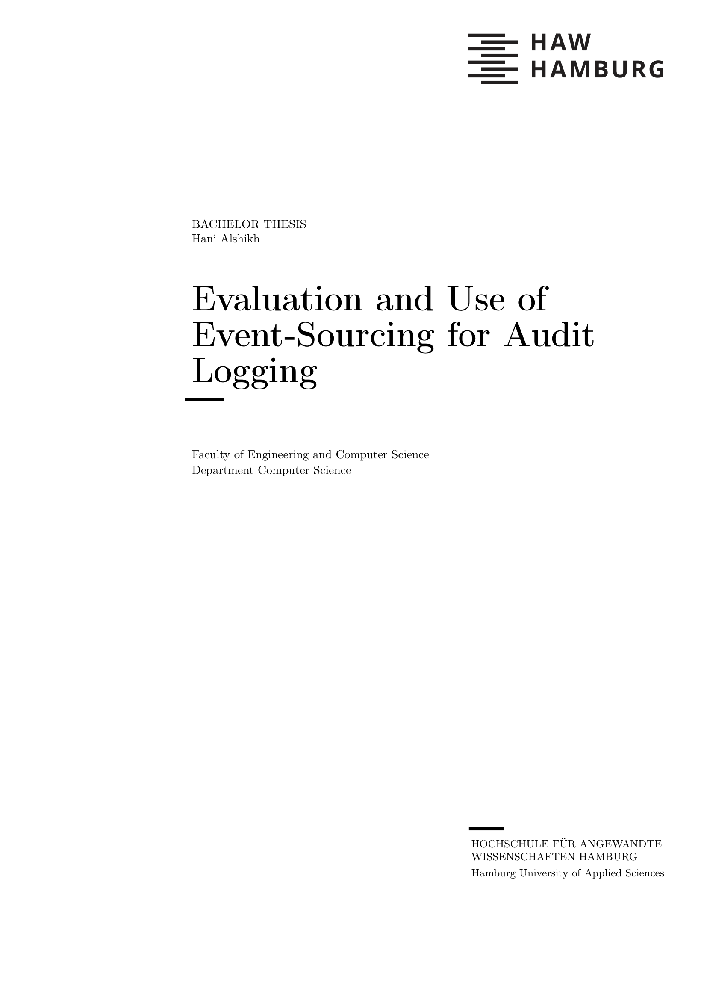

# Evaluation and Use of Event-Sourcing for Audit Logging

Keeping accurate audit records is a requirement for compliant IT systems, especially when used in sensitive industries such as government, finance, infrastructure, etc.

Event-Sourced architectures are rapidly gaining in popularity as they provide reliability, flexibility, and scalability. One of the primary benefits of Event-Sourcing is the complete and immutable records of all events and state changes within the system, allowing for efficient and thorough audit logging by design.

This work evaluates Event-Sourcing in comparison to other patterns for audit logging as well as showcases how an event-sourced system to manage k8s multi-cloud multi-cluster authentication and authorization requests can be utilised to save organisations time and effort, when answering various compliance questions and requests, by implementing the corresponding Audit Component and Audit Browser.

